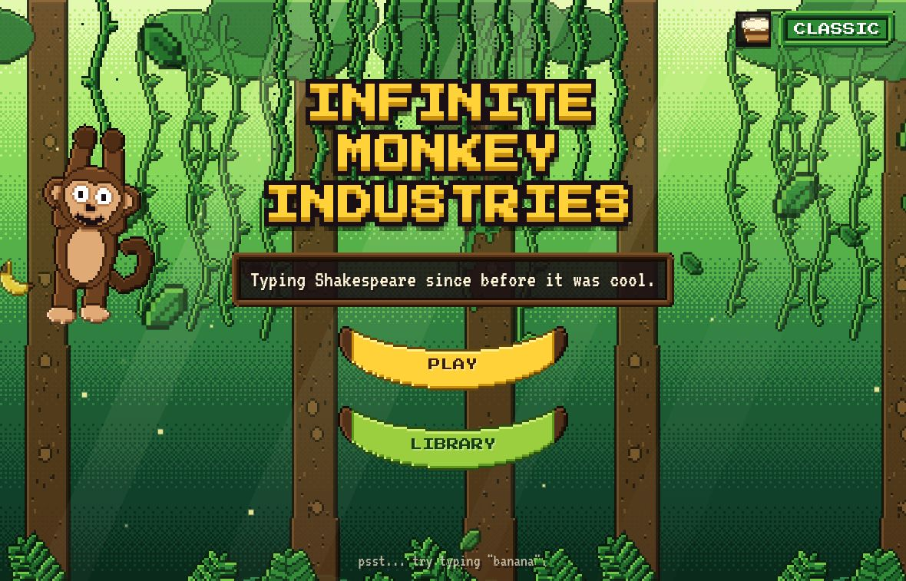
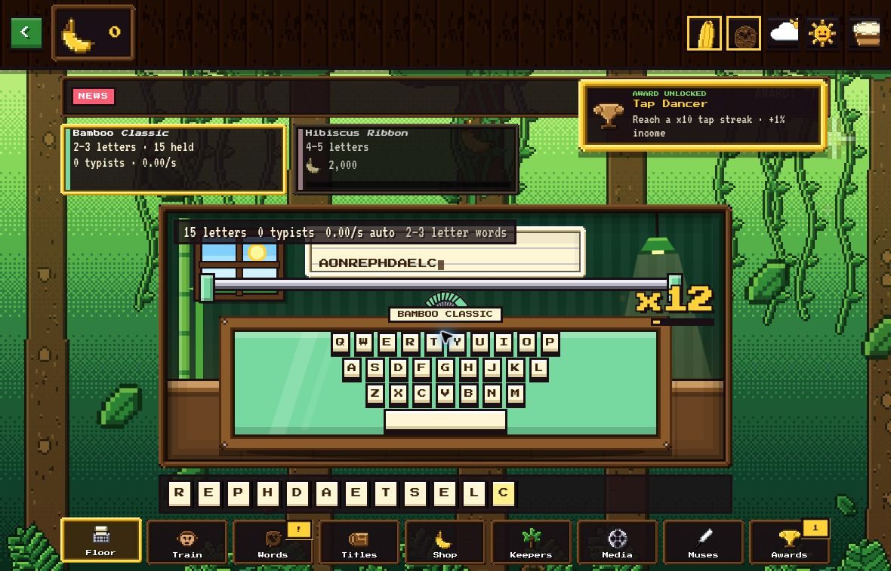
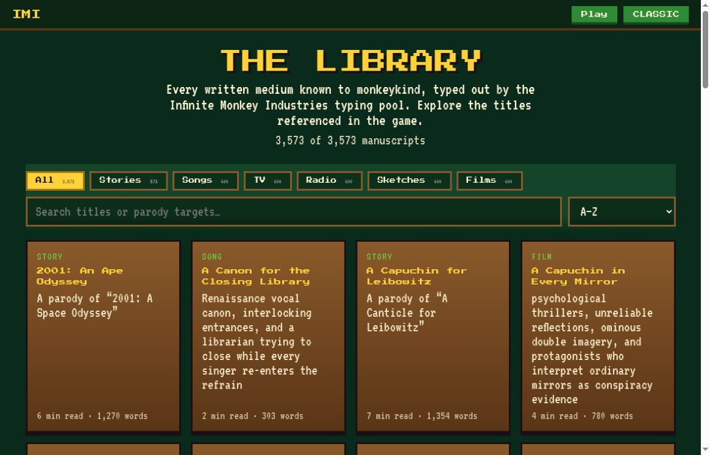

# Infinite Monkey Industries

### Turn random letters into a publishing empire.

A monkey-themed incremental browser game. Work the typewriter, hire a crew, bank words, and assemble them into titles you can sell for bananas and royalties. The factory grows from one bamboo desk into automated departments, media divisions, and a new printing with lasting progress.

**[Play the demo](https://imi.arrangedgodly.com/) · [Read the Library](https://imi.arrangedgodly.com/library.html) · [First shift](#your-first-shift) · [Departments](#learn-the-departments) · [Run locally](#run-locally)**



*The actual pixel-edition menu. Existing saved progress can change Play to Continue.*

## Your first shift

1. Choose **Play** and start at the Bamboo Classic typewriter.
2. Click or tap the typewriter, or focus its stage and press **Space / Enter**, to generate random letters.
3. Open **Train** to hire your first typist once you have the required letters.
4. In **Words**, turn available letters into valid words. Letters belong to individual desks; completed words enter a shared bank.
5. Open **Titles** to inspect a recipe. When its exact word requirements are available, **Write & sell** consumes them to publish that in-game title.
6. Reinvest bananas in the **Shop**, new machines, and automation. Published titles can keep earning royalties.

This is an incremental production game, not a free-text typing test. Clicking the machine generates letters; it does not ask you to transcribe a displayed sentence. Hold-to-type becomes available through a shop upgrade.



## Learn the departments

| Department | What you do there |
| --- | --- |
| **Floor** | Work the selected typewriter and watch letter production. |
| **Train** | Hire and train typists, inspect their traits, and customize crew names and hats. |
| **Words** | Bank words and grow specific letters in the letter garden. |
| **Titles** | Inspect recipes, create pitches, write and sell, manage rights, and read completed editions. |
| **Shop** | Spend bananas on machines and production upgrades. |
| **Keepers** | Automate word collection, choose recipe focus, and set stock targets. |
| **Media** | Develop passive production divisions. |
| **Muses** | Purchase and seat patrons that modify production. |
| **Awards** | Review statistics, awards, prestige, and challenge progress. |

On mobile, the last four departments are collected under **More**. The menu button returns to the title screen; Escape also returns from gameplay when a modal is not taking precedence.

### Machines change what you can make

| Machine | Word-length range | Place in progression |
| --- | --- | --- |
| **Bamboo Classic** | 2–3 letters | Free starting desk. |
| **Hibiscus Ribbon** | 4–5 letters | The next step toward longer recipes. |
| **Lagoon Sprint** | 6–7 letters | Expands the word supply further. |
| **Honeycomb Ledger** | 8–9 letters | Later production tier. |
| **Orchid Imperial** | 10–11 letters | Higher-cost expansion. |
| **Moonflower Grand** | 12–13 letters | Final machine tier in the current set. |

Machines are purchased in order, and later machines start with a typist. They also change the lettering style. There is no separate collectible-font shop in this implementation.

### Put the crew to work

Typists produce letters automatically and develop through traits, training, and levels. Keepers can then bank words, but their focus and stock targets matter: the default target is zero. Set the words or recipe you need rather than assuming a newly purchased keeper will build unlimited stock.

The toys in the side menu also interact with the game. A banana snack can accelerate typists, a coconut can grant letters, and weather/day-night states affect systems. The sound toggle controls synthesized effects. The menu's “banana” typing hint is an Easter egg, separate from the main typewriter controls.

## Publishing, pitches, and the Library

The game includes sixteen authored short editions and generated pitches with word recipes. Up to eight unsold pitched titles can be held at once. Selling rights is an in-game transaction, with royalty income afterward; it does not publish your writing to an outside service.



The standalone Library contains **3,573 committed manuscripts**: 573 stories and 600 each of songs, television episodes, radio plays, sketches, and films.

| Library control | Purpose |
| --- | --- |
| **Category filters** | Browse a particular medium. |
| **Search** | Find a title or parody target. |
| **A–Z / Shortest / Longest / Shuffle** | Change the reading order. |
| **Pagination** | Browse 48 entries at a time. |
| **Reader** | Open a manuscript. |
| **Another!** | Pick another work at random. |

### Titles you can write

Besides the sixteen authored editions and generated pitches, the Titles page carries **1,200 writable stories**: 300 children's books that use only words of three letters or fewer (shown a few at a time as a reading list) and **900 library stories with a 5-, 7- or 9-letter cap** (300 each, children's and general parodies), all available at once. A story's longest word decides which typewriter it needs: a 5-letter-cap story needs Hibiscus Ribbon, 7 needs Lagoon Sprint, 9 needs Honeycomb Ledger. The library stories pay roughly what pitches do per word, count toward their own awards, and do not count toward the "sell N titles" progression gates, so they fill the middle game without speeding it up.

The **Publisher's assistant** (Shop > Market tools, three tiers) sells your finished titles for you so the loop can run on its own: it sells one every 12 seconds (6 from the second tier, and the third also sells while you are away at an average price). A switch on the Titles page chooses **Any** price, **Fair** (hold until the market is at least x1.0) or **Hot** (hold until x1.4), and it never sells a title you focused by hand. Holding for a better price costs time early on, so the default is Any.

Each machine's keeper can be **tuned up** in the Shop (up to six levels, bananas) to bank words faster; the Words page shows each keeper's level.

The Titles page opens with the title you are writing, then a search box and sort dropdown, then these filters:

| Control | Purpose |
| --- | --- |
| **Open / Ready / Pitch / Sold / All** | What to list. |
| **Word max** (All, 3, 5, 7, 9, 11, 13) | Only titles whose longest word is that long, with a count on each chip. Picking a number also shows titles that need a typewriter you do not own yet, so you can browse ahead. |
| **Sort** (Closest, Pays most, Shortest, A–Z) | Order within each group. Titles are always grouped first: ready to write, the focused title, writable now, needs a bigger typewriter, then sold. |

Titles that need a typewriter you have not bought are hidden by default (**Show locked** reveals them). Your choices are remembered. The books you have sold live on their own **Shelf** sub-tab, which wears a badge when a new book arrives, so the list of titles to write is never pushed down the page.

Every department has one name in the interface: Floor, Train, Words, Titles, Shop, Media, Muses, Awards, Legacy. The open menu shows each name with a short line about what it does.

The readable archive and the game's writable recipes are different sets. Full-length archive recipes are explicitly locked in the current game; the manuscript count is not a count of titles you can already manufacture through the gameplay loop.

## Beyond the first printing

<details>
<summary><strong>Later systems implemented in the current source</strong></summary>

| System | What it adds |
| --- | --- |
| **Media divisions** | Additional passive production. |
| **Muses** | Nine purchasable patrons, with up to three seated slots. |
| **Letter garden** | Targeted-letter support. |
| **Machine restorations** | Mk II and Mk III progression. |
| **Rights market** | Demand swings that change title sale prices. |
| **Daily crate and banana events** | Periodic rewards and changing opportunities. |
| **Oulipo challenges** | Four constraint-based challenge modes. |
| **Second Printing** | Prestige with retained long-term progress. |

The first prestige star becomes available at 500,000 run earnings. Second Printing resets bananas, machines, typists, upgrades, deals, divisions, Muses, garden, and the word bank. It preserves awards/statistics, pitched titles, Legacy, and bookshelf history as earlier editions. Review its confirmation before committing.

</details>

### Reset and prestige are different

**Shop Reset** clears game state while retaining bananas. **Second Printing** resets bananas and the current production operation while retaining its documented long-term progress. Neither should be treated as a simple undo button.

## Saving and time away

Progress is stored in this browser's localStorage. Main game state saves every five seconds, with additional saves around actions and page lifecycle events. The banana balance is stored separately. Pixel and Classic editions share progress when opened on the same origin.

Offline progress simulates a bounded absence. Initially it covers up to two hours at 40% effort; Night Lamp upgrades extend the cap and efficiency. It accounts for typists, keepers, royalties, and divisions rather than literally leaving the browser running while closed.

There is currently no account, cloud sync, or save import/export interface. Clearing site data can erase progress. A localhost copy and the hosted demo have different storage origins and do not automatically share a save.

## Install it as an app

The site is a progressive web app. Open the hosted game in Chrome on Android and choose **Install app** (or **Add to Home screen**): it installs with its own icon, opens full-screen without the browser's address bar, and keeps working offline. On iPhone use Share, then **Add to Home Screen**. A service worker (`sw.js`) stores the game after the first visit and always prefers the network, so a new deploy appears as soon as you are online. Installing needs https (or localhost).

## Smoother play on slow phones

Settings has an **Effects** switch: **Auto**, **High** or **Low**. Low turns off the looping decoration (lamp sway, glints, shimmer, blinking hints, falling leaves), trims particles to a third, and draws the typists less often; taps, floating numbers and stamps still play. Auto, the default, starts on Low for very weak phones and switches itself to Low if the frame rate stays poor for a few seconds of play. It never switches back up by itself, and your choice is remembered. In code, `html[data-fx="low"]` drives the CSS and `IMI.fx.low` drives the game.

## How it is built

| Layer | Technology | Responsibility |
| --- | --- | --- |
| **Pages** | HTML + CSS | Menu, game shell, Classic edition, and Library. |
| **Game** | Vanilla JavaScript | Production, purchases, recipes, automation, progression, and saves. |
| **Shared shell** | `core.js` | Screen changes, banana balance, toys, and sound behavior. |
| **Artwork** | Generated pixel, SVG, and CSS visuals | Jungle scenes, sprites, particles, and edition-specific presentation. |
| **Sound** | Web Audio synthesis | Interactive effects generated in the browser. |
| **Typography** | Google Fonts | Pixel and display font families. |
| **Library content** | Local JSON indexes and Markdown files | Browsing and reading the committed manuscripts. |
| **Persistence** | localStorage | Browser-local game state and preferences. |

There is no application framework, package manifest, or frontend compilation step. Unlike a fully self-contained offline bundle, the page references Google Fonts, and the Library fetches its local content files over HTTP.

## Run locally

Clone the repository and serve its root with a static HTTP server:

```bash
git clone https://github.com/Arrangedgodly/imi-webpage.git
cd imi-webpage
python3 -m http.server 8123
```

On Windows, use the installed Python command, such as `py -m http.server 8123`. Open `http://localhost:8123`.

Use HTTP rather than opening the HTML as a `file://` URL, because the Library loads JSON and Markdown through fetch. The committed Library is ready to read without running the synchronization script. There are no `npm run dev`, `npm run build`, or `npm test` scripts in this repository.

### Development utilities

`tools/make-icons.mjs` builds every icon from two masters in `icons/src/`: `app-icon-master.png` (the installed app's icon: 192/512, maskable and Apple versions) and `favicon-master.png` (the browser tab icon, a closer crop that reads at 16-48px; also `favicon.ico`). Replace a master and run the script to regenerate. The masters are not deployed (see `.assetsignore`).

The repository includes balance tools that use `puppeteer-core`, a separately running HTTP server, and a local Chrome executable. They run the real game logic under seeded randomness and a virtual clock. See [BALANCE.md](BALANCE.md) for their setup and scope.

These simulations are not a complete regression suite. They do not cover every later system, including Muses, garden, rights-market timing, golden bananas, challenges, and prestige.

<details>
<summary><strong>Refresh the manuscript library</strong></summary>

`sync-library.mjs` can refresh content from a monkey-library checkout (it also copies `kid-stories/`, `kids.json`, `word-stories.json` and `word-stories/max-5|7|9/`). After a sync, run `node tools/build-kids-readers.mjs` and `node tools/build-word-readers.mjs` to regenerate the game's recipe files. Without a path argument, it clones Arrangedgodly/monkey-library. It deletes and replaces the existing `library/` directory, so preserve any local changes before running it. This is a maintenance action, not a prerequisite for playing the checked-in game.

</details>

## Source guide

| Area | Files |
| --- | --- |
| Pixel / Classic shells | `index.html`, `classic.html` |
| Shared interface and sound | `core.js` |
| Game systems and department UI | `ops.js`, `ops.css` |
| Pixel artwork | `pixel.js`, `app.js` |
| Classic artwork | `classic.js`, `classic.css` |
| Short-edition texts | `readers.js`, `readers-kids.js`, `readers-w5.js`, `readers-w7.js`, `readers-w9.js` (the last four are generated) |
| Standalone Library | `library.html`, `library.js`, `library.css`, `library/` |
| Presentation switching | `style-swap.js` |
| Balance tools | `tools/`, `BALANCE.md` |
